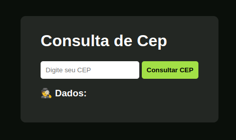

# 📮 Consulta de CEP

Uma aplicação web para consulta de CEP que fornece informações detalhadas com base no código postal fornecido pelo usuário.

## Veja o projeto pronto!
- Para ver o projeto [clique aqui](http://kade-meu-cep.surge.sh/).

## 🚀 Funcionalidades

- 🔍 Consulta de informações detalhadas como:
  - Logradouro
  - Bairro
  - Localidade
  - DDD
  - UF (Estado)
  - Região   
- ✅ Interface simples e estilizada para exibição dos resultados.

## 📷 Demonstração

- Insira seu CEP e veja a mágica:sparkles: acontecer!

## 🛠️ Tecnologias Utilizadas

- **HTML5**: Estrutura da aplicação.
- **CSS3**: Estilização da interface.
- **JavaScript**: Manipulação de dados, eventos e integração com a API.
- **DOM**: Para manipular elementos HTML e afins.
- **API ViaCEP**: Para buscar as informações baseadas no CEP.

## Feito com 💚 por [Alisson Oliveira](https://www.linkedin.com/in/alissonooliveira/) 😊
